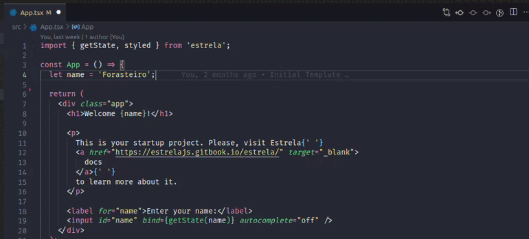
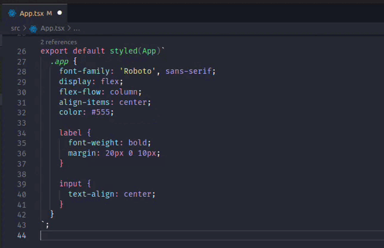

# Estrela for VSCode

## Features

This extension adds some IntelliSense code for Visual Studio Code.

### Getting State Reference

### Styling Components

## Known Issues

You can get the state reference but the type doesn't work correctly, in the end it will be just an `any` property.
